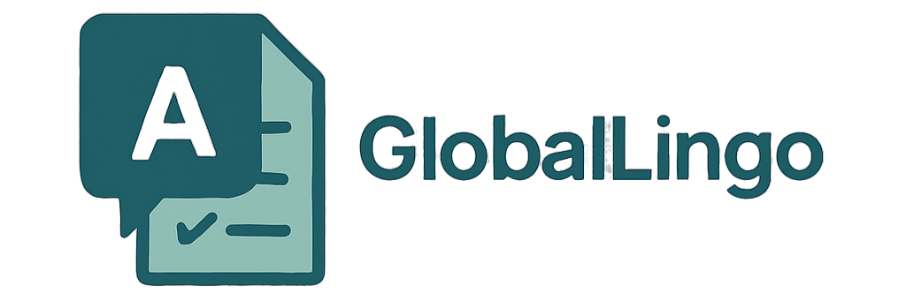

<div align="center">
  
</div>

**🚀GlobalLingo 1.0** is a Streamlit web app prototype developed as part of my MSc in Business Analytics. This project showcases two main functionalities:

🎯
- **Quiz Practice:**  
  Engage with fill-in-the-blank quizzes where the questions are generated on-demand using a Large Language Model. Practice grammar and tense rules across different topics and difficulties.

- **Translate with AI:**  
  Use AI-powered translation and OCR to practice language translation. Enter text—or even upload an image—and have the content translated from one language to another.

- **Quiz Records Dashboard:**  
  View your quiz results through interactive charts and metrics using Plotly visualizations.

---

## 📂 Repository Structure

- **logo.png**  
  The logo for GlobalLingo (displayed at the top of the app).

- **cohere.key** & **ocr.key**  
  API key files required for the Cohere and OCR integration, respectively.

- **quiz_results.csv**  
  A CSV file that stores quiz outcomes. It serves as the data source for the Quiz Records dashboard.

- **Main Application Code:**  
  The main code file (e.g., `app.py` or `codigo.txt`) contains all the logic for the three tabs:
  - **Quiz Practice**: Generates and displays quizzes.
  - **Translate with AI**: Offers text input and upload-to-translate capabilities.
  - **Quiz Records**: Displays analytics on past quiz attempts.

- **requirements.txt**  
  A list of dependencies to run the project.

---

## 🛠️ Requirements & Setup

This project is built using Python 3.8+ and relies on the following key libraries:
- [Streamlit](https://streamlit.io/)
- [Cohere](https://cohere.ai/)
- [Pandas](https://pandas.pydata.org/)
- [Plotly](https://plotly.com/python/)
- [Requests](https://docs.python-requests.org/)

### To set up the project locally:

1. **Clone the repository:**
   ```bash
   git clone https://github.com/your-username/your-repository.git
   cd your-repository